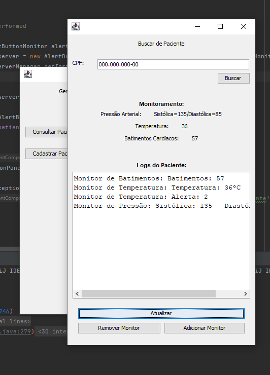

# Care

## Description

This project called Care, developed for the INFO1127 course - Software Engineering  - aims to create an IoT solution to hospitals interconnecting smart monitors (such as blood pressure, heart rate and temperature) which are configurable and are responsible to alert doctors when the monitored value is out of definded bondaries. Hence the main project's objetif is to decrease the time a doctor takes to respond to an emergency.


<p align="center">
     <br>
    Care Main UI
</p>

## Usage

Just open the ".jar" release with JRE

In linux bash,

```
java --jar care-1.0.0.jar
```

## Authors

- João Pedro Silveira
- Mayra Cademartori
- Artur Turatti
- Wellington M. Espindula.